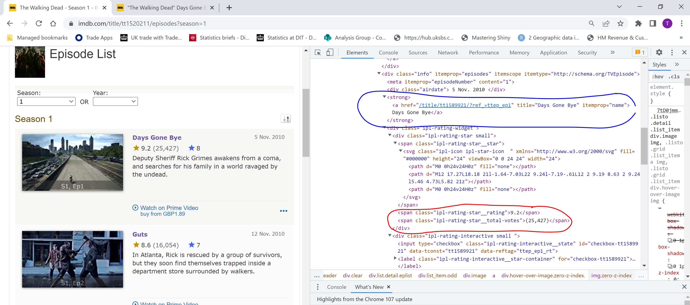

# Background

The Walking Dead is my favorite ever T.V show and I'm that sad I rate all of the episodes on IMDB. I have recently had to brush the dust off some old notes on web-scraping in R using rvest for a work related project. It then crossed my mind why not have some fun with it, web-scrape the IMDB scores and visualise them to see how the show has progressed in the eyes of many. I find it entertaining and I practice some R so it was a win-win. It is a bonus that I can brush up my rvest knowledge and skills and create a project from it!

While seeking an answer to a problem I ran into when first scraping IMDB I came across this great blog which I took inspiration from and learnt a few things form, credit where credit is due <https://eliocamp.github.io/codigo-r/en/2021/03/star-trek-rakings/>. 


### Rvest 

Rvest is an incredibly easy R package to use to web-scrape structured and unstructured data. Fortunately, IMDB is relatively structured so it is just a matter of identifying the correct divs and tags where all of the data is stored. There is some slight data wrangling, but that is it. The data is then good to go and play with. 

## Initial set up. 

Before embarking on a web-scrape you need to investigate the website using dev tools. This is to understand how the website is structured, how many weblinks you may need to scrape and most importantly where the dvis and tags. Understanding what data is avialable and what exactly you want to scrape is also a necessity. 

In this case, I want to grab every episode's user rating. This informaiton can be found on each indvidual season weblink. <https://www.imdb.com/title/tt1520211/episodes?season=1>, seaosn 2, 3 etc. This is simple enough. 

Diving under the hood by inspecting the dev tools (right click over your object, click inspect and you will see the HTML code). 

```{r, include=FALSE}
# load libraries
# Set up -------------------------

rm(list=ls()) # remove everything form global environment.

library(tidyverse)
library(openxlsx) 
library(readxl)
library(janitor)
library(stringr)
library(rvest)# most common web-scraping R package. (and very easy to pick up!)
library(tictoc) # simple function to monitor code chunk run time
library(data.table)
library(plotly)

path<-setwd(stringr::str_extract(rstudioapi::getActiveDocumentContext()$path,".+[/]"))# set working directory to where your file is saved. 

`%notin%` <- Negate(`%in%`) # Custom negate function

```


```{r}



```

There is multiple pieces of data we can extract. 

Firstly, having highlighted the first episode and inspected, reading through the HTML code the information is stored within the div with class "info". Within the div there are further divs breaking down this section. Following through the divs the information we require are storied within the div with class "ipl-rating-widget". This can be further broken down by the <span> div with class "ipl-rating-star__star" with each piece of data given a specific class. 

Alot of divs but reading through line by line the data we require can easily be identified as the website is strucuted and labelled ncie and easy for us to scrape. 


The first items I have highlighted in blue: the episode title and a hyperlink which directs you to an additional page with more episode statistics (more on this in the section demographics). These are stored within the <strong> div. The hyperlink is identified using the href tag. 

The second bits of data I have highlighted in red, the episode rating and number of votes are stored within the <span> div. 


# Code testing 

```{r}

url <- "https://www.imdb.com/title/tt1520211/episodes?season=1"
scraped_html <- rvest::read_html(url) # scrape HTML code
```


```{r}
# scrape episode title. 
# Stored within the strong and a tags within the list_item div. 
titles <-
  scraped_html %>%
  html_nodes(".list_item strong a") %>%
  html_text()

print(titles)

```


Great, we know this has worked as there is 6 episode and 6 items scraped. Simple. 
Before scraping the ratings we need to store the web-links of each episode which links to demographic data. 

```{r}
# scrape each episodes hyper link id. 
# This id we can create the unique neccessary to scrape from. 

scrape_ids <-
  scraped_html %>%
  html_nodes(".list_item strong a") %>%
  html_attr("href")

# clean up strings so we extract only what we need to generate a new webpage. 

scrape_ids <- strsplit(scrape_ids, "/") %>%# split string
  vapply(function(x) x[3], as.character(1)) # strip 3 item and convert to character

print(scrape_ids)

```

Next scrape the rating and number of votes and the final bit of informaiton; the episode airdate. We are then complete and ready to combine this info a useable format. 


```{r}

# scrape each episodes rating using the specific class identifying the correct span div. 
# the rating is stored within the div with class "info"
# the data is stored within the div with class .ipl-rating-start small. 
# the last tag is the class given the span where the rating is stored within. 

ratings <-
  scraped_html %>%
  html_nodes(".info .ipl-rating-star.small .ipl-rating-star__rating") %>%
  html_text() %>%
  as.numeric() # convert scrpaed text to numeric. 

# scrape episode votes
votes <-
  scraped_html %>%
  html_nodes(".info .ipl-rating-star.small .ipl-rating-star__total-votes") %>%
  html_text() %>%
  stringr::str_remove_all(.,"\\(|\\)|,") %>% # remove brackets and comma from scraped string
  as.numeric() # convert text to numeric

# scrape episode air date
# this is a nice easy one as the div class is unique for this data item. 

dates <-
  scraped_html %>%
  html_nodes(".airdate") %>%
  html_text() %>%
  lubridate::dmy() # convert to date type. 
  
line1 = paste0(titles[1],'\n',dates[1],'\n',ratings[1],'\n',votes[1])
cat(line1) # print each item as a seperate line

```

We now have all the episode information we need. We can easy combine this to create a data table or tibble. We can then bind all seasons episode ratings together. Simple. 

```{r}

df <-
  tibble(
    season = 1, # season 1 as the example
    ep_no = "", # create episode number column
    ep_title = titles,
    ep_date = dates,
    rating = ratings,
    votes = votes
  ) %>%
  mutate(ep_no = row_number()) # create episode number. 

```

### Extract all seasons

And that is season one episode ratings done. Testing is done. Each season webpage follows the same structure and will produce the same data format which is perfect. We can create a function and run this for each season. 

```{r}

get_wd_season_data <- function(seasonNo){
  
  print(paste0("Web-scraping ratings data from season ",seasonNo))
  
  #' function input is the season number. 
  # define web-link with season number input. 
  url <- paste0("https://www.imdb.com/title/tt1520211/episodes?season=",seasonNo) 
  scraped_html <- rvest::read_html(url) # scrape HTML 
  
  titles <- # scrape episode titles
   scraped_html %>%
   html_nodes(".list_item strong a") %>%
   html_text()

  ratings <-
   scraped_html %>%
   html_nodes(".info .ipl-rating-star.small .ipl-rating-star__rating") %>%
   html_text() %>%
   as.numeric() # convert scraped text to numeric. 

 # scrape episode votes
 votes <-
   scraped_html %>%
   html_nodes(".info .ipl-rating-star.small .ipl-rating-star__total-votes") %>%
   html_text() %>%
   stringr::str_remove_all(.,"\\(|\\)|,") %>% # remove brackets and comma from scraped string
   as.numeric() # convert text to numeric

  # scrape episode air dates
  dates <-
   scraped_html %>%
   html_nodes(".airdate") %>%
   html_text() %>%
   lubridate::dmy() 
  
  df <-
  tibble(
    season = seasonNo, 
    ep_no = "", 
    ep_title = titles,
    ep_date = dates,
    rating = ratings,
    votes = votes
  ) %>%
  mutate(ep_no = row_number())
  
  
}

# create season input. 
seasons <- seq(1,10,1)

tic()
wd_data <- lapply(seasons,get_wd_season_data) %>% bind_rows()
toc()

```

All seasons ratings data has now been scraped, cleaned and combined ready for use. Web-scraping in R really is simple and easy to do using rvest. 

```{r}

print(tail(wd_data,5))

```


# Demographic data

We identified that for each episode there is an individual hyperlink which takes users to a page with the demographic breakdown of the ratings for that episode. We previously scrapped the unique id for each episode we need to scrape the demography data. First we will examine and test the initial scrape of an episode before automating this process through the use of a function. 


## Code testing 

Like before and any web-page you scrape you need to investigate the underlying HTML/CSS code to identify what divs,tags,classes your data are stored within. 

```{r}

knitr::include_graphics("img/wd_img_html_ep1demo.png")

```
There are three distinct tables of data on each web-link. The first are the ratings broken down by rating number, this will be interesting to plot across seasons. The second is a demographic table of ratings and the third off the screenshot captures US and non-US veiwers. Conveniently all of this data are stored in nice neat table divs which making scrape this page more simple. 


```{r}

# scrape web-page html 
url2 <- paste0("https://www.imdb.com/title/",scrape_ids[[1]],"/ratings/")

scraped_html2 <- read_html(url2)

#' the ratings website stores all data 
#' conveniently within table divs. 
#' all tables stored in list. 
scraped_tables <- 
  scraped_html2 %>%
  html_nodes("table") %>%
  html_table() 

# scrapes 3 unique tables

# ratings table
rating <- scraped_tables[[1]] %>% # extract ratings table from list
  clean_names() %>% 
  mutate(
    season = 1, # create season number column
    ep_number = 1 # create episode number column
  ) %>% 
  relocate(c("season","ep_number"), .before = "rating") %>%
  rename(rating_prop = x) 

print(head(rating,5))

```


``` {r}

# compile demography data
# demog data requires splitting into two columns using separate 
demo <- scraped_tables[[2]] %>% # extract demog data from list
   clean_names() %>%
   mutate(across(everything(), ~ stringr::str_squish(.x))) %>% # clean strings
   pivot_longer(cols=c(-x), names_to = "demog", values_to = "val") %>%
   separate(col = val, into = c("demo_rating","demo_votes"),sep = " ") %>%
   mutate(
     season = 1,
     ep_number = 1
    ) %>% 
   relocate(c("season","ep_number"), .before = "x") %>%
   rename(gender = x)

print(head(demo,5))

```

```{r}

# scrape us rating table

us_vote <- scraped_tables[[3]] %>% # extract us-rating data from list
   clean_names() %>% 
   mutate(
     season = 1,
     ep_number = 1 # i is the iteration 
    ) %>%
   select(-1) %>%
   mutate(across(everything(), ~ stringr::str_squish(.x))) %>%
   relocate(c("season","ep_number"), .before = "us_users") %>%
   pivot_longer(
     cols = us_users:non_us_users,
     names_to = "user_type", values_to = "val"
     ) %>%
   separate(col = val, into = c("rating","votes"), sep = " ") 

print(head(us_vote,2))

```
So far we have scraped all of season 1 data. We have demonstrated scraping one episodes demography data. Now we can create a function to extract the full seasons demography data across each episode. 

```{r}

get_demog_data <- function(seasonNo,ids){

# empty data tables to insert scraped data. 
demo_df <- data.table()
rating_df <- data.table()
us_df <- data.table()

for(idNo in 1:length(ids)){

#' In the initial imdb scrape each episode had a unique 
#' hyperlink linking to the vote data broken down by demographics. 
#' The web-link only changes its unique ID number. 
#' each link is scraped through using the unique ID number from each href. 
#' each episode is orders through 1:N. the Id Number
#' acts as the episode identifier. 

 print(paste0("Web-scraping season ",seasonNo," episode ",idNo," demographic breakdown"))
  
 url2 <- paste0("https://www.imdb.com/title/",ids[[idNo]],"/ratings/")

 scraped_html2 <- read_html(url2)

#' the ratings website stores all data 
#' conveniently within table divs. 
#' all tables stored in list. 
 scraped_tables <- 
   scraped_html2 %>%
   html_nodes("table") %>%
   html_table() 

# demography table. 
# data for rating and number of votes is within one cell. 
# convert table to long format then split out into two columns. 

 demo <- scraped_tables[[2]] %>%
   clean_names() %>%
   mutate(across(everything(), ~ stringr::str_squish(.x))) %>%
   pivot_longer(cols=c(-x), names_to = "demog", values_to = "val") %>%
   separate(col = val, into = c("demo_rating","demo_votes"),sep = " ") %>%
   mutate(
     season = seasonNo,
     ep_number = idNo
    ) %>% 
   relocate(c("season","ep_number"), .before = "x") %>%
   rename(gender = x)


  rating <- scraped_tables[[1]] %>%
   clean_names() %>% 
   mutate(
    season = seasonNo,
    ep_number = idNo # i is the iteration 
    ) %>% 
   relocate(c("season","ep_number"), .before = "rating") %>%
   rename(rating_prop = x)

 us_vote <- scraped_tables[[3]] %>%
   clean_names() %>% 
   mutate(
     season = seasonNo,
     ep_number = idNo # i is the iteration 
    ) %>%
   select(-1) %>%
   mutate(across(everything(), ~ stringr::str_squish(.x))) %>%
   relocate(c("season","ep_number"), .before = "us_users") %>%
   pivot_longer(
     cols = us_users:non_us_users, 
     names_to = "user_type", 
     values_to = "val"
     ) %>%
   separate(col = val, into = c("rating","votes"), sep = " ") 
   
 # bind data together for each episode breakdown
  demo_df <- bind_rows(demo_df,demo)
  rating_df <- bind_rows(rating_df,rating)
  us_df <- bind_rows(us_df, us_vote)
  
 
}

# store all data within list.   
demo_list <- list(demo = demo_df,
                  rating = rating_df,
                  us_df = us_df)

return(demo_list) # function returns list as object

} # end function

```


## Extract full datasets 

The above function using the scraped seasons data and ids to compile each episodes demographic breakdown place each dataset within a list to be called. The inputs require the season number and the unique web-link ids from the aforementioned season. Therefore this function can be combined with the same code we tested into one full function. This can be then run to scrape all seasons ratings and demographic breakdown. 

```{r}

get_full_series_data <- function(seasonNo){
  
  options(warn=-0) # turn off warning messages for function
  print(paste0("Web-scraping ratings data from season ",seasonNo))
  url <- 
    paste0("https://www.imdb.com/title/tt1520211/episodes?season=",seasonNo)
  
  scraped_html <- read_html(url)
  
  
  
  # scrape date of each episode
  scraped_date <- 
    scraped_html %>%
    html_nodes(".airdate") %>%
    html_text() %>%
    lubridate::dmy()
  
  
  # scrape episode title
  scraped_title <-
    scraped_html %>%
    html_nodes(".clear .list_item .info strong a") %>%
    html_attr("title")
  
  
  # scrape rating and votes
  # Both are within the same div so can scrape together. 
  scraped_rating <-
    scraped_html %>%
    html_nodes(".clear .list_item .info .ipl-rating-star.small") %>%
    html_text() %>%
    stringr::str_squish()
  
  # scrape html
  scraped_id <-
    scraped_html %>%
    html_nodes(".clear .list_item .info strong a") %>%
    html_attr("href")
  
  # ids for web-links of rating/demographic breakdowns. 
  ids <- strsplit(scraped_id, "/") %>%# split string
    vapply(function(x) x[3], as.character(1)) # strip 3 item and convert to character
  
  
  df <- 
    tibble(
      season=seasonNo,
      ep ="", 
      ep_title = scraped_title,
      ep_date = scraped_date,
      rating = scraped_rating
    ) %>%
    mutate(
      ep = row_number(), # row number for each episode
      rating = str_remove_all(rating,"\\(|\\)") # remove brackets
    ) %>% 
    separate(
      col = 
        rating, 
      into = c("ep_rating","ep_votes"), 
      " ") # split out rating col into two. 
  
  
  demog_data <- get_demog_data(seasonNo,ids) 
  
  data_list <- list(data = df, demog = demog_data)
  return(data_list)
}

seasons = c(seq(1,10,1))
tic()
wd_full_data <- lapply(seasons,get_full_series_data)
toc()

```

Now all the data is scraped. The data is stored within a list, split into two, the first item is the full episode ratings for all seasons within "data". The second contains the three demography data sets. These are split across each season so need binding together to make complete data sets. This can be done simply using lapply and data.table package rbindlist. 

```{r}
# bind rating data
wd_data <- 
  rbindlist(lapply(wd_full_data,function(x)x$data),use.names=T,fill=T) %>% 
  mutate(ep_votes = str_remove(ep_votes,",")) %>%
  mutate(across(c(ep_votes:ep_rating), ~ as.numeric(.x))) %>%
  mutate(ep_no = row_number()) # to enable time-series plot. 

# bind demography data
wd_data_demog <- 
  rbindlist(lapply(wd_full_data,function(x)x$demog$demo),use.names=T,fill=T) %>%
  mutate(demo_votes = str_remove(demo_votes,",")) %>%
  mutate(across(c(demo_rating:demo_votes), ~ as.numeric(.x)))

# bind rating breakdown data
wd_data_ratings <- 
  rbindlist(lapply(wd_full_data,function(x)x$demog$rating),use.names=T,fill=T)%>%
  mutate(votes = str_remove(votes,",")) %>%
  mutate(rating_prop = str_remove(rating_prop,"%")) %>%
  mutate(across(c(rating_prop:votes), ~ as.numeric(.x)))

# bind us-rating data
wd_data_ratings_us <- 
  rbindlist(lapply(wd_full_data,function(x)x$demog$us_df),use.names=T,fill=T) %>%
  mutate(votes = str_remove(votes,",")) %>%
  mutate(across(c(rating:votes), ~ as.numeric(.x)))


# save data output
save(wd_data,wd_data_demog,wd_data_ratings,wd_data_ratings_us, file = "data_output/wd_data_full.RData")

```


## Walking dead viewership

This I have always found interesting. The Walking Dead at it's peak was the most popular and most viewed show out there. It was larger than Game of Thrones. Deservedly so. How these ratings changed over time and then collapse is quite stark. I want to see how the the number of ratings, actual ratings and viewership potentially correlate. We can easily scrape this from wikipedia to create a new dataset. 

```{r}

wiki_url <- "https://en.wikipedia.org/wiki/List_of_The_Walking_Dead_episodes"

wiki_html <- read_html(wiki_url)

# the tables we need are easily identifiable via the table div's class:
wiki_scrape <-
  wiki_html %>%
  html_nodes(".wikitable.plainrowheaders.wikiepisodetable") %>% 
  html_table()

# inspecting the scraped tables, we only need the first 11 items:

wiki_scrape <- wiki_scrape[1:11]

# inspecting the data further we can simply bind each table together as they are all in the same format. 
# First we need to create the season number and clean the viewership data text. 
# can simply create a function and apply this across each df in the list. 
seasons = seq(1,11,1)

func=function(x,y){x<-x%>%clean_names() %>%
  mutate(season=y, # create season no.
         u_s_viewers_millions = # remove data within brackets in text. 
           as.numeric(gsub("\\[[^\\]]*\\]", "",  u_s_viewers_millions, perl=TRUE)
         ))}

views = mapply(FUN=func,x=wiki_scrape,y=seasons,SIMPLIFY=FALSE) %>% 
  rbindlist(fill=TRUE) %>% 
  select(-written_by_160,-original_air_date_161) # remove redundnet columns

```

The Walking Dead IMDB ratings have now been scraped. 

Next how to visualise this information. 

# Visualisating The Walking Dead episodic rasting history

There is a great amount of data compiled. I will explore different aspects separately but ultimately I want to be able to see clearly how ratings of IMDB have changed over time and how they compare to my own ratings. Then how do these ratings vary by age-group and gender and then what interesting trends which can be identified. 

## Episode rating time-series

First; upload my Walking dead ratings as an input

```{r}

my_scores = read_excel("wd_my_scores.xlsx")

wd_data %>%
  ggplot(aes(x=ep_no,y=ep_rating))+
  geom_line(
    aes(x=ep_no,y=ep_rating,
      color = as.character(season),
      group=1),
    size=1.2)+ #group = 1 ensures lines are connected across groups.
  geom_line(
    data = function(x) copy(x)[, ep_rating := mean(ep_rating), by = as.character(season)], # add hor. line for avg. fo season.
    aes(color = as.character(season)), 
    size = 1) +
  geom_line(
    data=my_scores,
    aes(x=ep_no,y=my_rating,group=season),
    color="grey50",size=0.6,alpha=0.8)+
  theme_minimal()+
  scale_y_continuous("",limits = c(1, 10), n.breaks = 7)+ # fix y-axis scale
  xlab("")+ggtitle("The Walking Dead Episodic Rating History")+
  #scale_color_manual(values=c(colr))
  scale_color_brewer(palette = "Paired",guide="none")+
  theme(
    plot.title = element_text(size = 12, hjust = 0.5),
    axis.text.x = element_blank(),
    panel.grid.major.x = element_blank(),
    panel.grid.minor.x = element_blank()
  )


# note in order to group the data for colour the x-axis comprises off a simple 1:N sequence in steps of 1. 

```

Clearly my scores peak much more than the average rater. I was mesmerized by seasons 3 to 6, specifically the first half of season 3, the end of season 4 and the majority of season 5 mvoing into season 6; this being peak walking dead for me. Then strangely, my views tended to move towards the average following the decline from season 7. Season 9 was a genuinely good season, it deserved more views. The damage was done after the slow laborious  season 7 and 8 (at times overall it was still good). 

**Back to plots..**

Alternatively we can use ggplots facet grid to plot each individual season ratings and place them side-by-side. I like both, both have their benefits. 

```{r}

wd_data%>%
  ggplot(aes(x=ep_no,y=ep_rating))+
  geom_line(aes(color=as.character(season),group=1),size=1)+
  facet_grid(~season,  scales = "free_x",switch = 'x')+
  theme_light()+
  scale_y_continuous("",limits = c(3, 10), n.breaks = 7)+ # fix y-axis scale
  xlab("")+ggtitle("The Walking Dead Episodic Rating History")+
  scale_color_brewer(palette = "Paired",guide="none")+
    theme(
      panel.spacing = unit(-0.45, "lines"), # edit facet panel spaces so closer together. 
      axis.text.x = element_blank(),
      axis.ticks.x=element_blank(), # remove x axis ticks
      strip.placement = "bottom", # move facet labels to bottom of plot
      plot.title = element_text(size = 11, hjust = 0.5),
      panel.grid.minor.x = element_blank(),
      panel.grid.major.x =  element_blank(), # remove grid lines
      panel.grid.minor.y = element_blank(),
      panel.grid.major.y = element_blank()
    )

```


